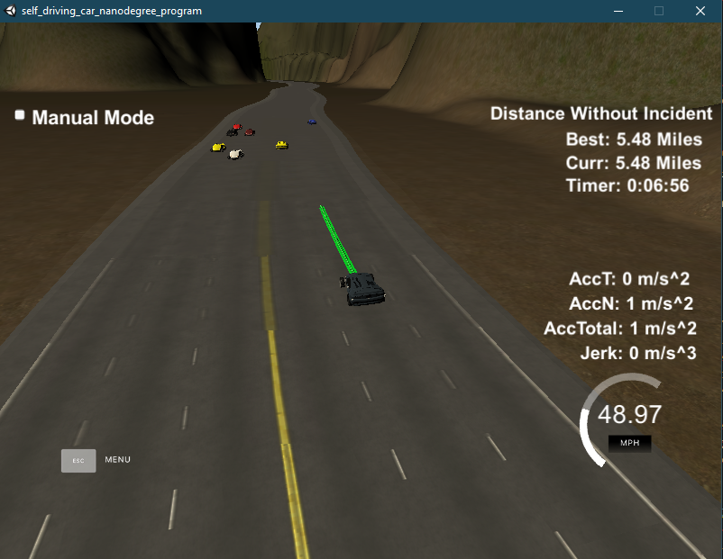

# CarND-Path-Planning-Project
Self-Driving Car Engineer Nanodegree Program

Like the title suggests, this project will plan a path through the highway simulator provided by Udactiy. More detail of the project is provided in the writeup at end of the README provided by Udacity.

## Generating Path

In this project, the walkthrough addresses on how to generate a path by using `spline.h` and has given us an idea on how to complete the code in order to generate paths for the car to drive.

## Path Planning

This is the core of this project as it deals with how to handle traffic in the simulator.  Instead of using AI, I have instead created mapped states for the vehicle transition in [vehicle.h](src/vehicle.h).  Not only that but also this class will hold all the current states of the car that can later be used in other parts of the code.  

For each particular state there will be a possible outcomes for the car.  The possible scenarios are:

1. Turn if car is ahead
2. Stay in lane if other lanes have cars infront
3. Stay in lane if dangerous to turn
4. Acclerate when no cars ahead, or during turn.

I have implemented the code in handling these transitions in the [cost.cpp](src/cost.cpp) file.  For every current state of the car there will be possible actions and the car will validate which action is best to take given the traffic at that particular time.  
   
## Result  

  

With the codes implemented I was able to drive around the track over 4.32 miles.  I was able to achieve over 5 miles every single time I ran the simulator.

## Reflection

When building the code, the main aspect in determining whether a change should change state is if the car detects that there is another car infront of it within 30 meters of range.  If this were the case it would prefer to change lanes.  Before doing so, the car has to check 2 things, is there a car within 10 meters of the car in the interested lane and is there a car ahead in the interested.  If there is no trouble the car can choose either to turn left or to turn right as both options are better than to stay in lane.  If there is an obstacle, the car will stay in the lane.  Furthermore, before changing lanes, another metric that is considered is how much free distance there is in the lane that the car will want to change.  The lane with the longest free distance gets chosen.

I feel that the path planning process can be improved further to account for moving unpredictable cars.  If not our car could potentially crash when there is a lot of traffic and 1 car suddenly changes into the car's lane.

Overall it was a very interesting project.  I've spent my fair share of time around this project testing all different states and handling the states in particular.

---

### Simulator.
You can download the Term3 Simulator which contains the Path Planning Project from the [releases tab (https://github.com/udacity/self-driving-car-sim/releases/tag/T3_v1.2).  

To run the simulator on Mac/Linux, first make the binary file executable with the following command:
```shell
sudo chmod u+x {simulator_file_name}
```

### Goals
In this project your goal is to safely navigate around a virtual highway with other traffic that is driving +-10 MPH of the 50 MPH speed limit. You will be provided the car's localization and sensor fusion data, there is also a sparse map list of waypoints around the highway. The car should try to go as close as possible to the 50 MPH speed limit, which means passing slower traffic when possible, note that other cars will try to change lanes too. The car should avoid hitting other cars at all cost as well as driving inside of the marked road lanes at all times, unless going from one lane to another. The car should be able to make one complete loop around the 6946m highway. Since the car is trying to go 50 MPH, it should take a little over 5 minutes to complete 1 loop. Also the car should not experience total acceleration over 10 m/s^2 and jerk that is greater than 10 m/s^3.

#### The map of the highway is in data/highway_map.txt
Each waypoint in the list contains  [x,y,s,dx,dy] values. x and y are the waypoint's map coordinate position, the s value is the distance along the road to get to that waypoint in meters, the dx and dy values define the unit normal vector pointing outward of the highway loop.

The highway's waypoints loop around so the frenet s value, distance along the road, goes from 0 to 6945.554.

## Basic Build Instructions

1. Clone this repo.
2. Make a build directory: `mkdir build && cd build`
3. Compile: `cmake .. && make`
4. Run it: `./path_planning`.

A really helpful resource for doing this project and creating smooth trajectories was using http://kluge.in-chemnitz.de/opensource/spline/, the spline function is in a single hearder file is really easy to use.

---

## Dependencies

* cmake >= 3.5
  * All OSes: [click here for installation instructions](https://cmake.org/install/)
* make >= 4.1
  * Linux: make is installed by default on most Linux distros
  * Mac: [install Xcode command line tools to get make](https://developer.apple.com/xcode/features/)
  * Windows: [Click here for installation instructions](http://gnuwin32.sourceforge.net/packages/make.htm)
* gcc/g++ >= 5.4
  * Linux: gcc / g++ is installed by default on most Linux distros
  * Mac: same deal as make - [install Xcode command line tools]((https://developer.apple.com/xcode/features/)
  * Windows: recommend using [MinGW](http://www.mingw.org/)
* [uWebSockets](https://github.com/uWebSockets/uWebSockets)
  * Run either `install-mac.sh` or `install-ubuntu.sh`.
  * If you install from source, checkout to commit `e94b6e1`, i.e.
    ```
    git clone https://github.com/uWebSockets/uWebSockets 
    cd uWebSockets
    git checkout e94b6e1
    ```
